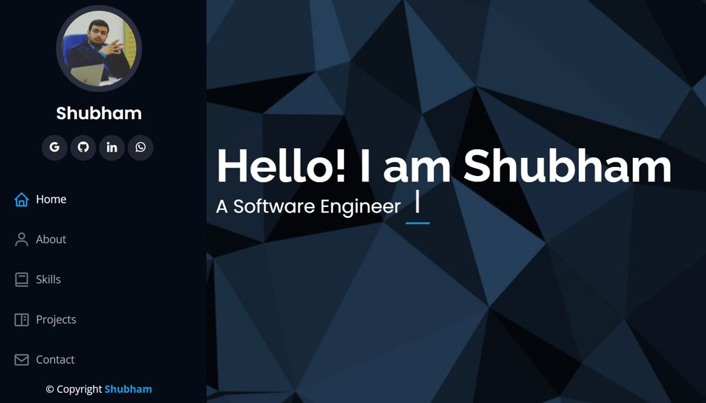

# My Portfolio Website
<a href="https://tiwarishubham635.github.io/My-Portfolio-Website/" target="_blank">Deployed Link</a>

  

 

 &nbsp;

## Components

It is a portfolio website consisting of the following sections:

1. Homepage and Navbar - Animated Homepage with Sidenav and Hamburger Navbar according to the Screen-Size.
2. About - Basic Personal Details.
3. Skills - List of technical skills with level of proficiency
4. Projects - Details of the projects and github links.
5. Contact - Basic details and embedded location map with contact form.

## This Project is made using:

1.  React.js
2.  Bootstrap

## To run the repository on the system:

1.  Clone the repository using "git clone https://github.com/tiwarishubham635/My-Portfolio-Website.git"
2.  Install node_modules via "npm install"
3.  Use "npm start" to run the development server

 &nbsp;

